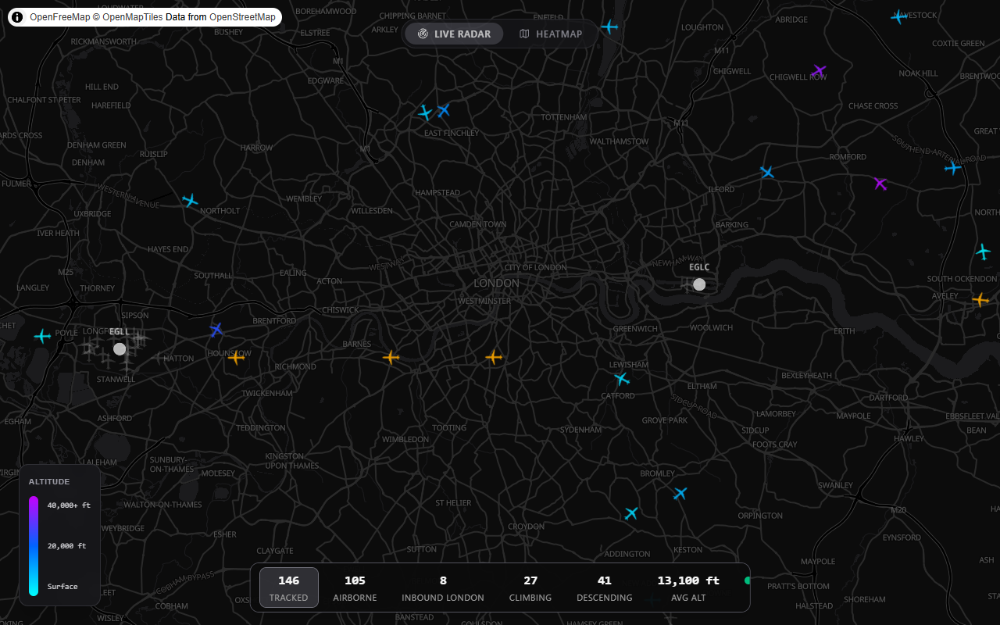

# ✈️ Flight Tracker at Home

Real-time aviation dashboard showing aircraft around the London airspace with London airport arrival tracking.

**▶ Live: [flight-tracker-at-home.pages.dev](https://flight-tracker-at-home.pages.dev)**

[](https://github.com/ColinCee/flight-tracker-at-home/actions/workflows/ci.yml?query=branch%3Amain)
[](https://github.com/ColinCee/flight-tracker-at-home/actions/workflows/deploy.yml?query=branch%3Amain)
[](https://flight-tracker-at-home.pages.dev)
[](https://api.colincheung.dev/health)



## What it does

- Plots live aircraft on a dark-themed interactive map (OpenFreeMap tiles), with emergency squawks highlighted
- Highlights planes approaching an airport in orange (heading + altitude + "ILS check")
- Real-time KPIs: tracked, airborne, inbound airport, climbing, descending, avg altitude, plus a rolling 60-minute arrival throughput counter
- Click any aircraft for callsign, altitude, speed, heading, and squawk; click an airport for current weather (MET Norway)
- 3D heatmap view of historical traffic, binned into H3 hexagons

## Stack

| Layer | Tech |
|-------|------|
| Frontend | React 19, Vite 8, Tailwind CSS |
| Map | MapLibre GL JS, react-map-gl, Deck.gl |
| State | TanStack Query (auto-polling) |
| Backend | Python 3.12, FastAPI |
| Data | [adsb.lol](https://adsb.lol/) REST API (ODbL) |
| E2E Tests | Playwright |
| Monorepo | Nx + Bun + mise |
| Deploy (FE) | Cloudflare Pages |
| Deploy (BE) | Docker image on a self-hosted mini-PC + Cloudflare Tunnel |

## Run locally

Requires [mise](https://mise.jdx.dev), which manages all tool versions (Bun, Node, Python, uv).

```sh
mise install        # install runtimes
mise run setup      # install all dependencies + git hooks
mise run dev        # start frontend (localhost:4200) + backend (localhost:8000)
```

## How it works

```
adsb.lol API → Backend (FastAPI + 10s cache) → Frontend (React + Deck.gl)
```

The backend fetches aircraft positions from adsb.lol (any ADSBx v2 endpoint via `ADSB_API_URL`), enriches them with a Heathrow approach heuristic, and caches results with a 10-second TTL. The frontend polls the backend and renders aircraft on a map with real-time KPIs.

See [docs/ARCHITECTURE.md](./docs/ARCHITECTURE.md) for deep dives into the data contract, caching strategy, and design decisions.

## Commands

```sh
mise run dev          # Start frontend + backend
mise run check        # Lint, format check, type check
mise run test         # Unit tests (pytest + vitest)
mise run test:e2e     # E2E tests (Playwright, uses mock data)
mise run format       # Auto-fix formatting
mise run codegen      # Regenerate frontend types from backend schema
```

## Project Structure

```
apps/
├── frontend/              # React + Vite + Tailwind
├── backend/               # Python FastAPI
└── e2e/                   # Playwright tests
docs/
├── ARCHITECTURE.md        # Technical reference
├── PRODUCT-FEATURES.md    # Product requirements
└── SELF-HOST.md           # Self-hosting the backend
```

## Docs

- **[docs/ARCHITECTURE.md](./docs/ARCHITECTURE.md)** — Technical decisions, data contract, and stack
- **[docs/PRODUCT-FEATURES.md](./docs/PRODUCT-FEATURES.md)** — Product spec and scope
- **[docs/SELF-HOST.md](./docs/SELF-HOST.md)** — Self-hosting the backend with Dokploy + Cloudflare Tunnel

## Deployment

| Component | Platform | Trigger |
|-----------|----------|---------|
| Frontend | Cloudflare Pages | Auto-deploy on merge to `main`; preview deploys on PRs |
| Backend | Docker image on GHCR | Built and pushed on merge to `main`; run by [homelab](https://github.com/ColinCee/homelab) |
| Networking | Cloudflare Tunnel | `api.colincheung.dev` → backend container |

The workflow badges at the top show current CI and deploy status.
